<div align="center">

# 💳 CredScore

**Explainable credit risk scoring for loan applications — from raw data to a decision you can defend.**

Every applicant gets a probability of default, a 300–850 credit score, a risk band, a recommended decision
and a per-feature explanation of how that score was reached.

[](https://credscorelive.streamlit.app)
[](https://codespaces.new/piyushp69/CredScore?quickstart=1)


**[Live demo](https://credscorelive.streamlit.app)** · [Links](#links) · [Screenshots](#screenshots) · [Results](#results) ·
[Model card](#model-card) · [Quick start](#quick-start) · [REST API](#rest-api) · [How it works](#how-it-works)

</div>

<br>

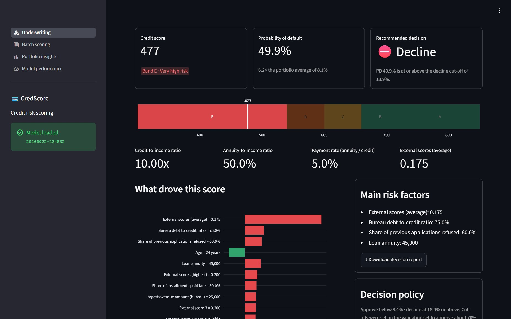

## Highlights

- **A decision, not just a number** — probability of default, 300–850 credit score, risk band A–E and an
  approve / manual review / decline recommendation from validation-set cut-offs.
- **Explained factor by factor** — exact TreeSHAP contributions from XGBoost itself, plus plain-language risk reasons.
- **What-if analysis** — vary one input and watch the probability of default cross the decision cut-offs.
- **Batch scoring** — score a CSV of applicants; bad rows are reported, not fatal.
- **Honest evaluation** — every metric comes from a held-out test set of 46,127 applications, with calibration,
  policy economics and fairness monitoring.
- **Two front doors** — a Streamlit dashboard and a FastAPI REST service share one scoring engine.

## Links

- 🌐 **Live dashboard:** [credscorelive.streamlit.app](https://credscorelive.streamlit.app)
- 📄 **Pages:** [Underwriting](https://credscorelive.streamlit.app) · [Batch scoring](https://credscorelive.streamlit.app/batch) ·
  [Portfolio insights](https://credscorelive.streamlit.app/portfolio) · [Model performance](https://credscorelive.streamlit.app/performance)
- 💻 **Source code:** [github.com/piyushp69/CredScore](https://github.com/piyushp69/CredScore)
- ☁️ **Try it in your browser:** [Open in GitHub Codespaces](https://codespaces.new/piyushp69/CredScore?quickstart=1)
- 🗂️ **Dataset:** [Home Credit Default Risk on Kaggle](https://www.kaggle.com/competitions/home-credit-default-risk)
- 🖥️ **Run locally:** dashboard at [localhost:8501](http://localhost:8501) ·
  API docs at [127.0.0.1:8000/docs](http://127.0.0.1:8000/docs) ([ReDoc](http://127.0.0.1:8000/redoc)) —
  see [Quick start](#quick-start)

## Screenshots

Captured from the live app at [credscorelive.streamlit.app](https://credscorelive.streamlit.app); the REST API docs
come from a local run, since the API is not deployed there.

### Underwriting

Score one applicant from a form (or start from a typical, strong or risky example), see why the model decided
what it did, and test what would change it.

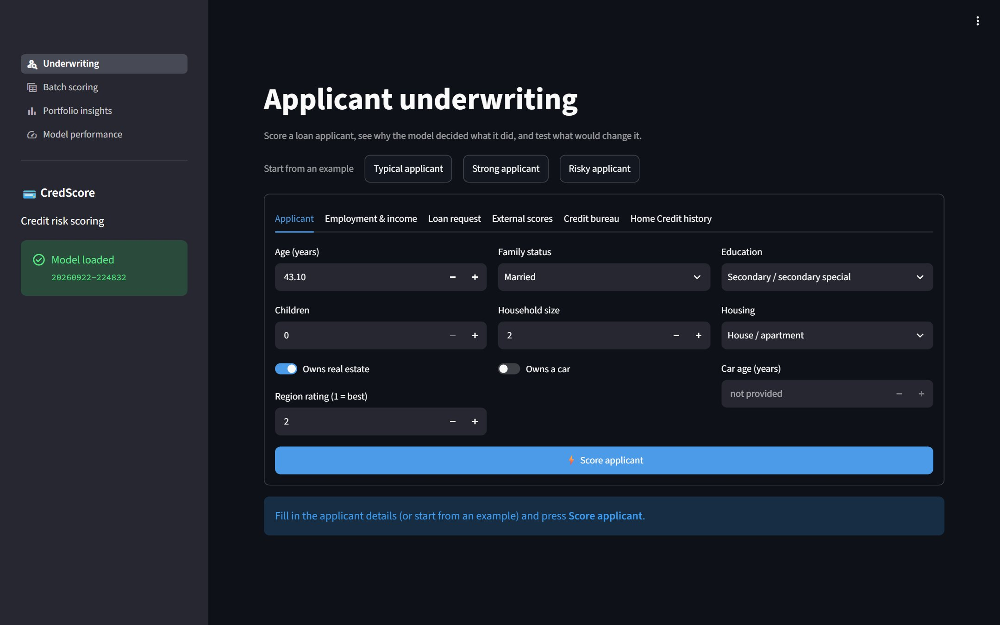

<details>
<summary><b>Scored result, explanation and what-if analysis</b> — 3 more screenshots</summary>
<br>

**Scored applicant** — score, band, probability of default, decision and the key affordability ratios.


**What drove the score** — SHAP contribution of each factor, the main risk factors and the decision policy.

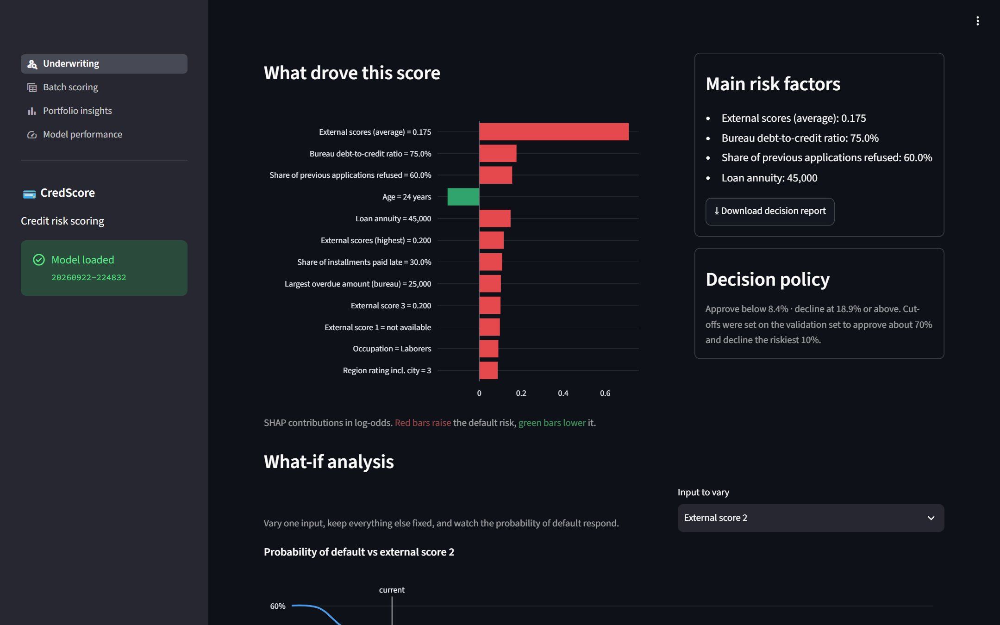

**What-if analysis** — one input varied, everything else fixed, against the approve and decline cut-offs.

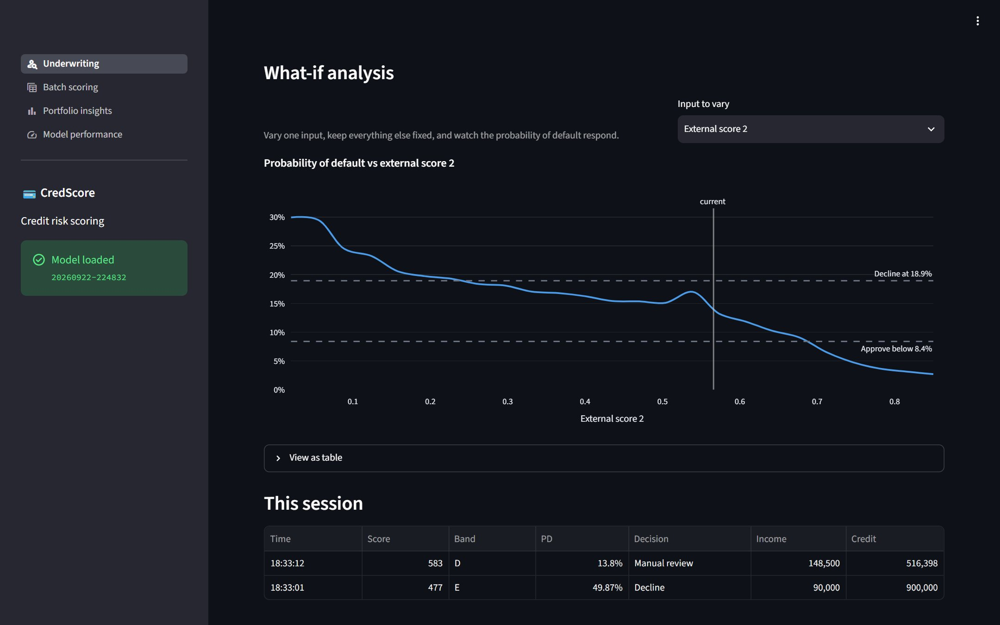

</details>

### Batch scoring

Score a whole CSV of applicants (template or 250 demo applicants provided): score distribution, decision mix,
per-row risk reasons and errors, and a results download.

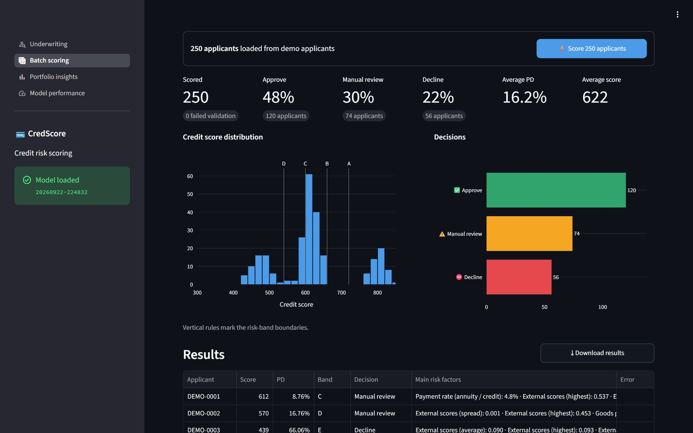

<details>
<summary><b>Per-applicant results</b> — 1 more screenshot</summary>
<br>

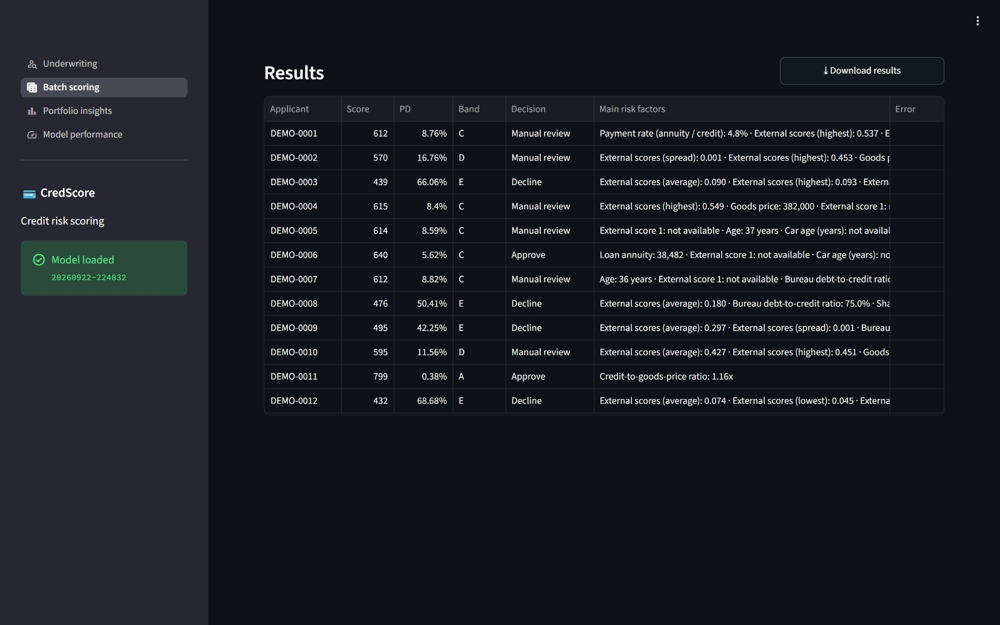

</details>

### Portfolio insights

Observed default rates across 15 segments of the 307,511 labelled applications, and where the risk concentrates.

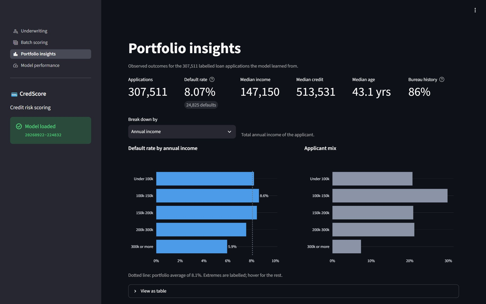

<details>
<summary><b>Where the risk concentrates</b> — 1 more screenshot</summary>
<br>

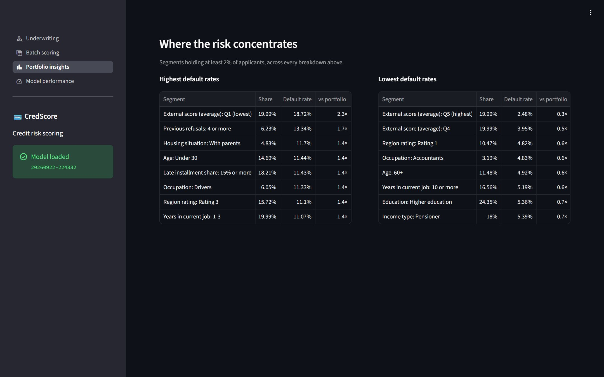

</details>

### Model performance

Discrimination, calibration, decision-policy economics, global feature importance and fairness monitoring — all
measured on the held-out test set.

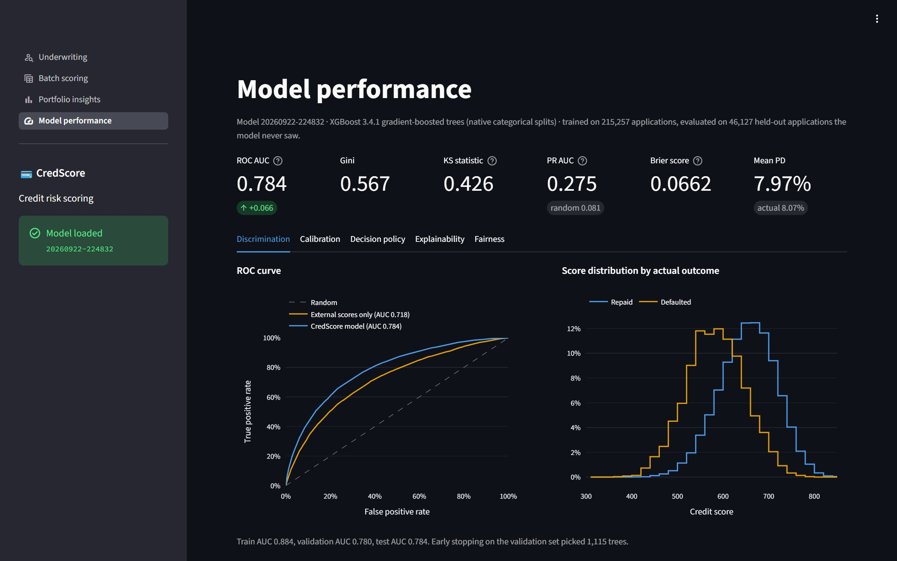

<details>
<summary><b>Calibration, decision policy, explainability and fairness</b> — 4 more screenshots</summary>
<br>

**Calibration** — predicted probability of default against observed default rate.

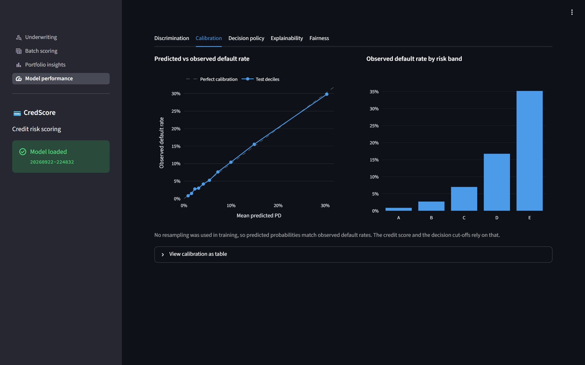

**Decision policy** — outcomes of the approve / review / decline cut-offs, cumulative gains and risk deciles.

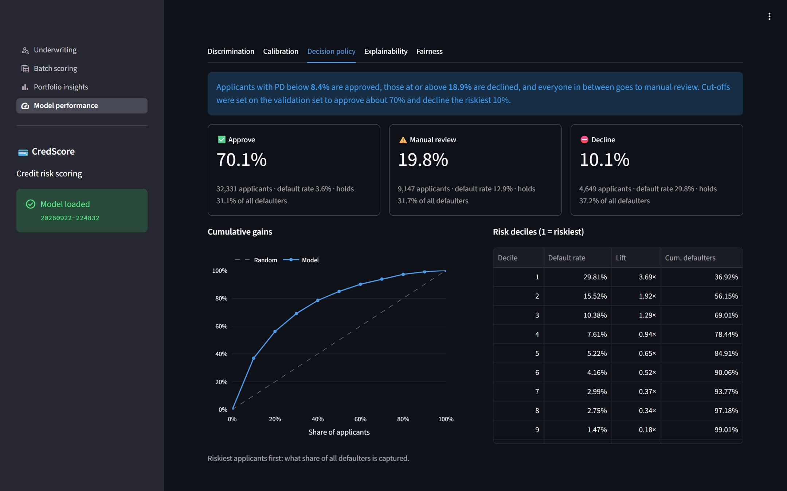

**Explainability** — the 20 features that move scores the most, and the inputs deliberately left out.

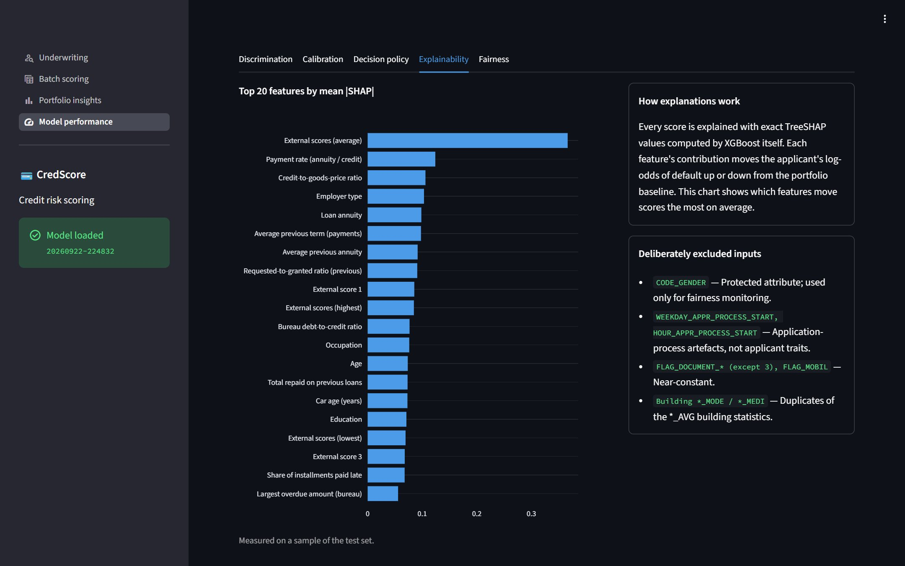

**Fairness** — approval and default rates by gender and age band; gender is not a model input.

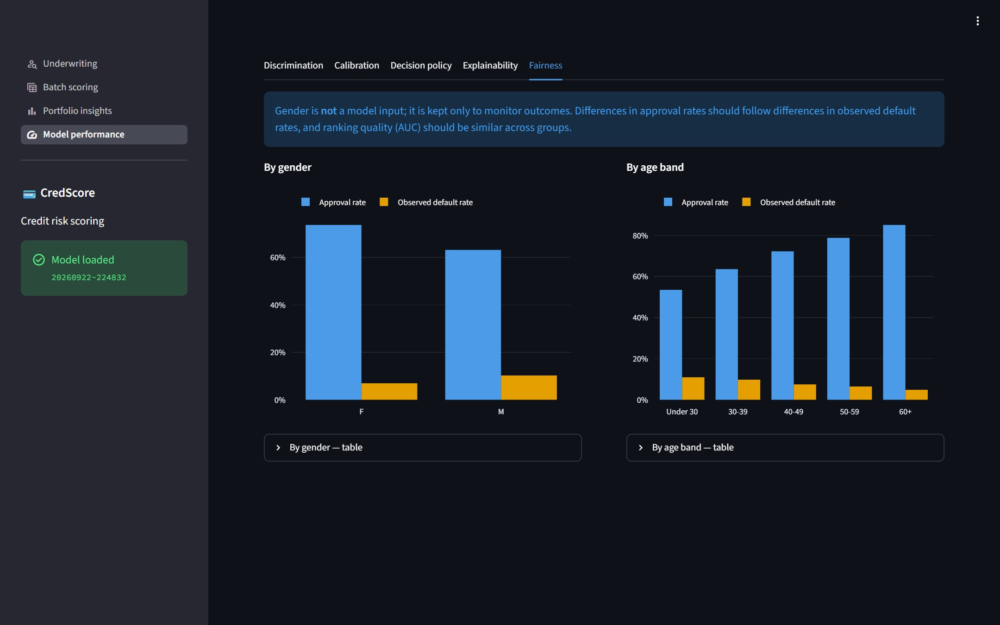

</details>

### REST API docs

Interactive OpenAPI docs at `/docs` for every endpoint of the [REST API](#rest-api).

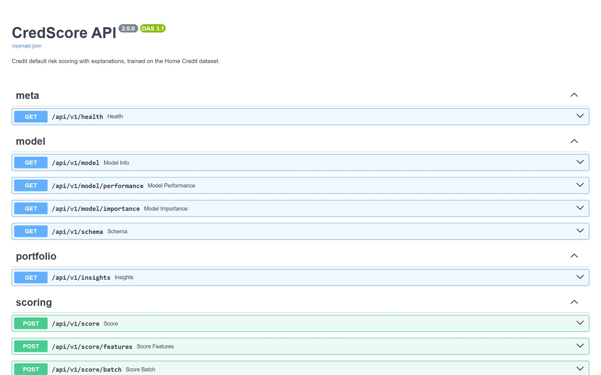

## Results

Measured on a held-out test set of **46,127 applications** that the model never saw during training or tuning:

| Metric | Model | Baseline (external scores only) |
|---|---|---|
| ROC AUC | **0.784** | 0.718 |
| Gini | 0.567 | 0.435 |
| KS | 0.426 | 0.326 |
| PR AUC | 0.275 | 0.195 |
| Brier score | 0.0662 | not calibrated |

Predicted probabilities match reality: across risk deciles, mean predicted PD tracks the observed default rate
(e.g. 30.3% predicted vs 29.8% observed in the riskiest decile), and the average predicted PD of 7.97% matches
the 8.07% actual base rate.

The decision policy derived from the validation set approves the safest 70% (PD below 8.4%) and declines the
riskiest 10% (PD of 18.9% or more):

| Decision (share of applicants) | Default rate | Share of all defaulters |
|---|---|---|
| Approve (70.1%) | 3.6% | 31.1% |
| Manual review (19.8%) | 12.9% | 31.7% |
| Decline (10.1%) | 29.8% | 37.2% |

## Model card

- **Data** — the [Home Credit Default Risk](https://www.kaggle.com/competitions/home-credit-default-risk) dataset:
  307,511 labelled loan applications, of which 24,825 (8.07%) ran into payment difficulties. Four tables are used:
  `application_train`, `bureau`, `previous_application` and `installments_payments`.
- **Split** — 70 / 15 / 15, stratified: 215,257 applications to train, 46,127 to validate (early stopping and the
  decision cut-offs) and 46,127 to test.
- **Features** — 113 model inputs: 69 application fields, 29 per-applicant aggregates of the bureau,
  previous-application and installment tables, and 15 derived ratios such as credit-to-income and payment rate.
  12 categorical fields use XGBoost's native categorical splits; gender is excluded.
- **Model** — XGBoost 3.4.1 gradient-boosted trees (binary logistic objective, learning rate 0.03, max depth 6,
  min child weight 30, 80% row and 50% column subsampling, L2 penalty 5). Early stopping picked 1,115 trees;
  training took 44 s on a GPU.
- **Accuracy** — ROC AUC 0.884 on train, 0.780 on validation and 0.784 on test; test Brier score 0.0662 and log
  loss 0.238. The most influential inputs are the average external score, payment rate, credit-to-goods-price
  ratio, employer type and loan annuity.
- **Score** — 650 points at 20:1 good:bad odds, 40 more points per doubling of the odds, clipped to 300–850.
- **Decision policy** — approve below a probability of default of 8.4%, decline at 18.9% or above, manual review in
  between (see [Results](#results)).

Risk bands, with the default rate observed in each on the test set:

| Band | Credit score | Default rate |
|---|---|---|
| A — very low risk | 720–850 | 0.9% |
| B — low risk | 660–719 | 2.7% |
| C — moderate risk | 600–659 | 7.0% |
| D — high risk | 540–599 | 16.7% |
| E — very high risk | 300–539 | 35.2% |

## Quick start

```bash
git clone https://github.com/piyushp69/CredScore.git
cd CredScore
pip install -r requirements.txt

# 1. (optional) Retrain: a trained bundle is committed in models/.
#    Downloads ~1.5 GB from Kaggle if dataset/ is empty.
python -m credscore.pipeline all          # ~2 minutes with a GPU, ~10 on CPU

# 2. Dashboard -> http://localhost:8501
streamlit run streamlit_app.py

# 3. (optional) REST API -> http://127.0.0.1:8000  (docs at /docs)
uvicorn backend.app:app --port 8000
```

The Kaggle download needs credentials (`~/.kaggle/kaggle.json` or `KAGGLE_USERNAME` / `KAGGLE_KEY`) and
acceptance of the [competition rules](https://www.kaggle.com/competitions/home-credit-default-risk/rules).
If the CSVs are already in `dataset/`, the download step is skipped.

Individual steps: `python -m credscore.pipeline {download,features,train,insights}`, with `--sample 20000` for a
fast run, `--device cpu|cuda|auto`, `--data-dir`, `--model-dir`.

## Dashboard

[Streamlit](https://streamlit.io) app (`streamlit_app.py` + `dashboard/`) with interactive
[Plotly](https://plotly.com/python/) charts on a colour-vision-safe palette. Theme and upload limits live in
`.streamlit/config.toml`.

| Page | What it does |
|---|---|
| **[Underwriting](#underwriting)** | Score one applicant, see the decision, the SHAP factor breakdown, plain-language risk reasons and a what-if curve. Downloads a JSON decision report. |
| **[Batch scoring](#batch-scoring)** | Score a CSV of applicants. Score distribution, decision mix, per-row reasons and errors, results download. |
| **[Portfolio insights](#portfolio-insights)** | Observed default rates across 15 applicant segments, plus where risk concentrates. |
| **[Model performance](#model-performance)** | Discrimination, calibration, policy economics, feature importance and fairness, from the test set. |

The dashboard and the API are independent: both load the model bundle in-process through
[`credscore.service.ScoringService`](credscore/service.py), so the dashboard needs no API server running. The model
is loaded once per server process (`st.cache_resource`) and shared by every session.

## REST API

[FastAPI](https://fastapi.tiangolo.com) service in [`backend/app.py`](backend/app.py); interactive docs at `/docs`.

- `GET /api/v1/health` — liveness and loaded model version
- `GET /api/v1/model` — version, test metrics, decision policy, scorecard
- `GET /api/v1/model/performance` — curves, calibration, gains, bands, fairness
- `GET /api/v1/model/importance` — global mean |SHAP| importance
- `GET /api/v1/schema` — applicant fields, allowed category values, defaults
- `GET /api/v1/insights` — portfolio default rates by segment
- `POST /api/v1/score` — score one applicant profile
- `POST /api/v1/score/batch` — score up to 10,000 profiles; bad rows are reported, not fatal
- `POST /api/v1/score/features` — score raw model features (advanced)

```bash
curl -X POST http://127.0.0.1:8000/api/v1/score \
  -H 'content-type: application/json' \
  -d '{"age_years":38,"annual_income":225000,"credit_amount":600000,"annuity_amount":28000,
       "education":"Higher education","ext_source_2":0.68,"ext_source_3":0.62,
       "bureau_loans":4,"bureau_active_loans":1,"bureau_total_credit":850000,
       "prev_applications":2,"prev_approved":2}'
```

```json
{
  "probability_of_default": 0.021296,
  "credit_score": 698,
  "risk_band": {"code": "B", "label": "Low risk", "min_score": 660, "max_score": 719, "status": "good"},
  "decision": "APPROVE",
  "decision_reason": "PD 2.1% is below the approval cut-off of 8.4%.",
  "explanations": [
    {"feature": "EXT_SOURCE_MEAN", "label": "External scores (average)", "value": 0.65,
     "display_value": "0.650", "contribution": -0.56954, "effect": "decreases_risk", "source": "derived"}
  ],
  "reasons": ["Age: 38 years", "External score 1: not available", "Car age (years): not available"]
}
```

Applicant fields use human units (years, amounts, counts); the service maps them onto model features. Unspecified
optional fields fall back to the training population's typical value, and the response marks which factors came
from the applicant (`source: "applicant"`) versus a default.

## How it works

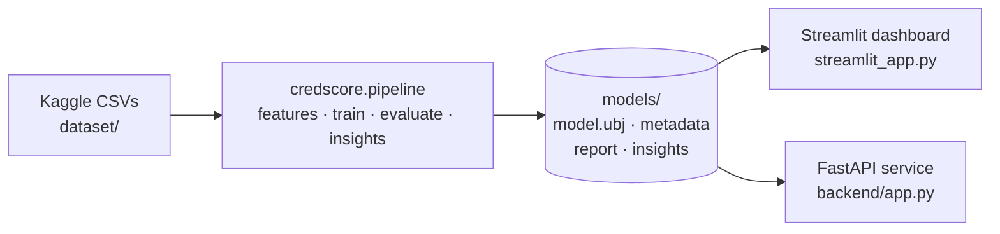

### Modelling decisions

- **Split before anything else.** Train/validation/test (70/15/15, stratified) is decided up front. Every reported
  number comes from the test set; the validation set only drives early stopping and the policy cut-offs.
- **No oversampling.** The 8% default rate is left alone. SMOTE on this data interpolates one-hot flags and
  median-imputed columns into values that cannot occur (a fractional `FLAG_PHONE`), so a model learns to detect
  synthetic rows instead of risk, and the resulting probabilities are no longer calibrated — which the credit score
  and the cut-offs depend on.
- **Missing stays missing.** [XGBoost](https://xgboost.readthedocs.io/en/stable/) learns a default direction per
  split, so no imputer is needed and "no credit bureau history" keeps its meaning instead of becoming a median.
- **Native categorical splits.** Category vocabularies are stored in the model bundle, so no encoder has to be
  replicated at serving time and unseen categories degrade to missing.
- **Explanations from the model itself.** Exact TreeSHAP via XGBoost's `pred_contribs`, so there is no separate
  explainer artifact to drift or unpickle.
- **Protected attributes.** `CODE_GENDER` is excluded from the model and retained only for fairness reporting.
  Application-process artifacts (weekday/hour of application) and near-constant flags are dropped too.
- **One feature module.** Training and serving share [`credscore/features.py`](credscore/features.py); derived
  ratios are always recomputed and never accepted as input, so the two cannot drift.
- **Native model format.** `model.ubj` rather than a pickle: portable across versions and safe to load.

Scoring uses a standard scorecard scaling: 650 points = 20:1 good:bad odds, and every 40 points doubles the odds,
clipped to 300–850.

## Project layout

```
credscore/             core package (shared by pipeline, dashboard and API)
  features.py          feature engineering + FeatureSpec (vocabularies, serving defaults)
  profile.py           human-friendly applicant profile -> model features
  model.py             model bundle: booster + spec + metadata
  service.py           scoring, explanations, decisions
  scoring.py           PD -> credit score, risk bands, decision policy
  evaluation.py        metrics, curves, gains, fairness
  labels.py            human-readable feature names and value formatting
  pipeline/            download -> features -> train -> insights (python -m credscore.pipeline)
backend/               FastAPI service (app factory, schemas)
streamlit_app.py       dashboard entrypoint: navigation, model status
frontend/
  dashboard.py         alternative entrypoint kept for the Streamlit Cloud deployment; runs streamlit_app.py
dashboard/             Streamlit pages
  common.py            model loading, formatting, chart styling, example applicants
  underwriting.py      · batch.py · portfolio.py · performance.py
models/                trained bundle: model.ubj, metadata, report, insights
docs/screenshots/      the screenshots in this README
tests/                 pytest suite incl. synthetic-data pipeline fixture
```

## Deployment

- **[Streamlit Community Cloud](https://docs.streamlit.io/deploy/streamlit-community-cloud)** — the live app at
  [credscorelive.streamlit.app](https://credscorelive.streamlit.app) deploys from the `main` branch on Python 3.10+,
  installing `requirements.txt`. Either `streamlit_app.py` or `frontend/dashboard.py` (a thin wrapper around it)
  works as the main file. The trained bundle in `models/` is committed, so no training happens on the server.
- **Docker** — `docker compose up --build` serves the dashboard on 8501 and the API on 8000 from one image, with
  `./models` mounted read-only.
- **GitHub Codespaces** — the dev container in `.devcontainer/` installs the requirements and starts the dashboard.

## Tests

```bash
python -m pytest            # 51 tests, ~20 s
```

The suite builds a synthetic Home Credit-shaped dataset, runs the real pipeline CLI over it, then exercises the API
and every dashboard page (headlessly, via Streamlit's `AppTest`) against that model — so it needs neither the
1.5 GB dataset nor a trained model.

## Configuration

Environment variables, all optional:

- `CREDSCORE_DATA_DIR` — raw CSVs and `features.parquet` (default `dataset/`)
- `CREDSCORE_MODEL_DIR` — model bundle, report and insights (default `models/`)
- `CREDSCORE_APPROVE_PD`, `CREDSCORE_DECLINE_PD` — override the decision cut-offs at serving time
  (default: the cut-offs from training)
- `CREDSCORE_CORS_ORIGINS` — comma-separated CORS allow-list for the API (default `*`)

## Limitations

- Trained on Home Credit's 2018 competition sample; it is a portfolio demonstrator, not a production credit policy.
- `bureau_balance.csv`, `POS_CASH_balance.csv` and `credit_card_balance.csv` are not used; adding them is the most
  obvious route past AUC 0.784.
- Decision cut-offs are set by target approval rates, not by expected loss or profit — real policy needs pricing,
  exposure and regulatory input.
- Fairness reporting covers gender and age bands on the test set only; it is monitoring, not a compliance review.

## Acknowledgements

Data from the [Home Credit Default Risk](https://www.kaggle.com/competitions/home-credit-default-risk) competition.
Built with [XGBoost](https://xgboost.readthedocs.io/en/stable/), [Streamlit](https://streamlit.io),
[FastAPI](https://fastapi.tiangolo.com), [Plotly](https://plotly.com/python/), [pandas](https://pandas.pydata.org)
and [scikit-learn](https://scikit-learn.org).
